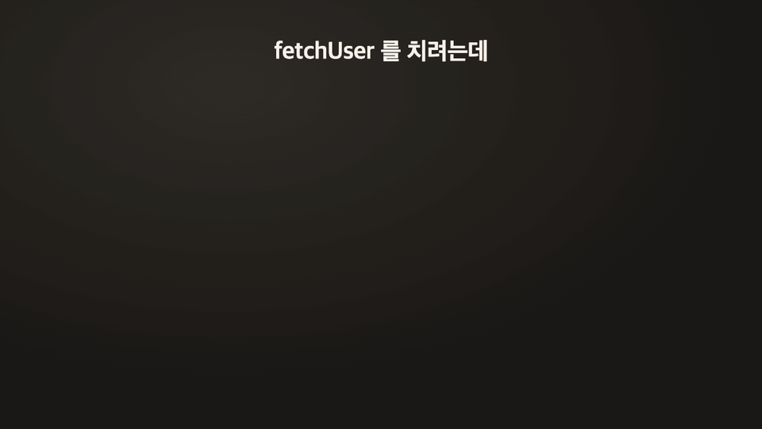

<p align="center">
  
</p>

<p align="center">
  
</p>

<p align="center">
  <a href="LICENSE"></a>
  
  
  
</p>

# claude-hangul

> **Claude Code mod 하나로 만든 한글 입력기.** OS IME 없이, 한/영 전환 없이.

Claude Code의 **mod**(함수 훅 플러그인) 기능으로 프롬프트 입력창에 한글 조합기를 직접 꽂았다.
두벌식, 세벌식 390, 세벌식 최종을 친다.
한/영 전환 키를 누르지 않아도 한글 단어는 한글로, 영어·숫자·기호는 친 그대로 남는다.

<p align="center">
  
</p>

## 왜 만들었나

Claude Code에 일을 시키면 한 줄에 한글 요청과 영어 코드가 섞인다.
`fetchUser 함수에 한글 주석 달아줘` 한 줄에 한/영 전환이 두 번이다.

- **한/영 전환이 꼬인다.** `fetchUser` 가 `ㄹㄷㅅ초ㅕㄴㄷㄱ` 이 되고, 고쳐 치면 `함수에` 가 `gkatndp` 가 된다.
- **macOS 전환 키가 씹힌다.** 누른 줄 알았는데 안 바뀌어 있다.
- **모바일에는 세벌식이 없다.** iPhone · iPad는 외장 키보드로 세벌식을 칠 방법이 아예 없고, Android는 기본 키보드에 없어 별도 입력기를 깔아야 한다.
- **iOS SSH 앱에서는 한글이 깨진다.** OS 한글 입력기로 Claude Code에 치면 자모가 흩어진다. 업스트림 이슈([#15705](https://github.com/anthropics/claude-code/issues/15705), [#23226](https://github.com/anthropics/claude-code/issues/23226))는 고쳐지지 않은 채 오래 반응이 없어 자동으로 닫혔다.

claude-hangul은 OS 입력기를 영어에 둔 채로 Claude Code 안에서 직접 한글을 조합한다.
코드는 친 그대로, 한글은 한글로. 전환 키를 누를 일이 없고, 입력기를 따로 깔 필요도 없다.

제품 요구는 [docs/PRD.md](docs/PRD.md), 구현 근거는 [docs/SPEC.md](docs/SPEC.md).

## 설치

Claude Code 안에서:

```
/plugin marketplace add proagent-ai/claude-hangul
/plugin install hangul@proagent
```

새 버전은 `claude plugin update hangul@proagent` 후 `/reload-plugins`.
Claude Code 2.1.287 이상.

### 모바일에서 세벌식으로

**외장 키보드 + 원격 터미널(SSH/mosh 터미널 앱, Orca 모바일 원격 등)로 호스트의 Claude Code에 접속할 때** 동작한다.

| 경로 | 동작 |
|---|---|
| iPad · Android 터미널 앱 → SSH/mosh → Claude Code | 된다 (설계 기준, 앱별 실기 확인 중) |
| Orca ADE 모바일 원격 → Mac 터미널의 Claude Code | 된다 (작성자 사용 환경) |
| Claude 앱 · Remote Control | 안 된다. 글이 입력창을 거치지 않고 통째로 도착한다 |
| 모바일 브라우저의 claude.ai/code (클라우드 세션) | 안 된다. 플러그인이 로드되지 않는다 |
| 화면 키보드 | 대상 아님. 외장 키보드 전용 |

1. 기기 입력 언어를 **영어**로 둔다. 한글은 claude-hangul이 조합한다.
2. 언어 전환 키를 모두 끈다. iPad는 설정 > 일반 > 키보드 > 하드웨어 키보드에서 **Caps Lock으로 언어 전환**을 끈다(iPadOS 버전마다 이름이 조금 다르다). Globe·⌃Space 전환도 쓰지 않는다. 실제 Caps Lock이 켜지면 세벌식에서 시프트 자리 글자(숫자·기호·겹받침)가 나온다.
3. 자동 수정·추천 단어를 끈다. mosh를 쓰면 `mosh --predict=never` (`-n`).
4. 한글 폰트를 보여 주는 터미널 앱, 접속한 쪽 locale은 UTF-8.
5. 호스트 셸 프로필에 `export HANGUL_LAYOUT=390` (또는 `final`)을 두면 `/hangul` 만 쳐도 그 레이아웃으로 켜진다.

앱별 설정, 증상별 원인, 문제를 알릴 때 남길 로그는 [docs/mobile.md](docs/mobile.md).
Claude Code 프롬프트에서만 동작하고, 셸이나 다른 프로그램 입력은 건드리지 않는다.

### 개발

```bash
git clone https://github.com/proagent-ai/claude-hangul.git
cd claude-hangul
git checkout develop
claude --plugin-dir .
```

작업 사본은 `--plugin-dir` 로 띄우고, 마켓플레이스 설치본과 같은 세션에 같이 올리지 않는다.

## 사용

| 명령 | 동작 |
|---|---|
| `/hangul` | 켜기 / 끄기 |
| `/hangul on` `off` | 명시적으로 켜거나 끈다 |
| `/hangul 2` `390` `final` | 레이아웃을 바꾸고 켠다 |
| `/hangul learn` | 이 맥의 Claude Code 대화 기록에서 내가 섞어 쓰는 영어·한글 단어를 배운다 |
| `/hangul forget` | 배운 단어를 지운다 |

`/hangul` 줄의 인자는 영어 그대로다. `off` 가 한글로 바뀌지 않는다.
상태줄은 `한 두벌식`, `한 세벌식 390`, `한 세벌식 최종` 이다.

시작 레이아웃은 `HANGUL_LAYOUT=2|390|final`. 세벌식 역순 확정은 `HANGUL_SEBEOL_ORDER=strict`.

## Claude Code mod로 만들었다

OS 입력기를 건드리지 않는다. Claude Code가 키 입력을 mod에 넘겨주고, mod가 조합한 결과를 돌려준다.
훅 4개와 상태줄 하나가 전부다 ([`hooks/register.tsx`](hooks/register.tsx)).

```
 키 입력 ─▶ prompt.edit ─▶ HangulEditor ─▶ 조합된 프롬프트
                              │
 /hangul ─▶ command.run ──────┤  레이아웃 전환
 엔터    ─▶ prompt.submit ────┘  조합 중인 글자 확정
 시작    ─▶ session.start       /hangul 등록, 상태줄 `한 두벌식`
```

```ts
on('prompt.edit', async ($, e, next) => {
  const answer = editor.edit(editOf(e))
  return answer.kind === 'pass' ? next(e) : answer.box  // 조합했으면 키를 소비
})
```

- **`prompt.edit`** — 키 하나마다 들어온다. 한글이면 조합해서 돌려주고, 아니면 `next(e)` 로 넘긴다.
- **`prompt.submit`** — 보내기 직전 조합 중인 음절을 확정한다.
- **`command.run`** + **`$.command.register`** — `/hangul` 슬래시 명령.
- **`$.ui.status`** — 상태줄의 `한 세벌식 390`.

조합 코어 `core/` 는 Claude Code API를 모르는 순수 TypeScript라서 다른 곳에도 그대로 쓸 수 있다.
mod는 Claude Code early access API라 릴리스마다 바뀔 수 있다.

## 한글과 그 밖의 글자

공백이나 기호 전까지를 한 단어로 본다.

- 그 단어가 완성 음절뿐이면 한글이다. 두벌식 `gksrmf`, 세벌식 `mfskgw` 는 `한글`.
- 음절이 아닌 조각이 확정되면 그 단어는 친 키 그대로다. 세벌식 `hello` 는 `hello` 다.
- 숫자만인 단어(`390`, `123`)는 숫자다. `?` `,` `!` 처럼 표에 없는 기호는 친 문자다.
- 두벌식 숫자·기호는 친 문자 그대로다.
- 원격 접속 지연으로 키가 몇 개씩 한 번에 오면, 줄바꿈 없는 ASCII 8글자 이하는 한 글자씩 친 것으로 조합하고 그보다 길면 붙여넣기로 보고 원문 그대로 넣는다. 실제 원격 환경에서의 묶음 크기는 아직 재 보지 않았다([로드맵](docs/ROADMAP.md)).
- 완성 음절뿐이어도 영어 쪽이 더 그럴듯하면 친 키로 돌아간다. 아래 [단어 판정](#단어-판정).

세벌식 시프트 숫자·기호는 레이아웃 표대로 바뀐다. 390 `J K L` 은 `4 5 6`, `B` 는 `!`. 최종 `J` 는 `1`, `B` 는 `?`.
세벌식은 숫자가 시프트 자리에만 있어 치환하지 않으면 칠 방법이 없다.
기호 키는 단어의 일부라서, 그 단어가 영어로 판정되면 친 키로 돌아간다. 390 `Hello` 는 `Hello`.
치환을 끄려면 코드에서 `passthroughLiterals: true`. 명령에는 없다.

## 단어 판정

세벌식에서는 영어도 자주 완성 음절이 된다. `gh` → `느`, `md` → `히`, `https` → `너펀`.
단어가 끝날 때 두 쪽을 견주어, 영어 쪽이 더 그럴듯하면 친 키로 되돌린다.

- 친 키가 개발 용어(`gh` `pr` `md` `npm` …)나 영어 사전 단어인가
- 조합된 한글이 흔한 한국어 단어인가 (`그` `해` `개` 는 한글로 둔다)
- 한국어에 거의 안 쓰는 음절(`햣` `둪`)이 있는가

| | 두벌식 | 세벌식 390·최종 |
|---|---|---|
| `gh` | `호` → **`gh`** | `느` → **`gh`** |
| `pr` | `pr` | `패` → **`pr`** |
| `md` · `https` | 그대로 | `히` · `너펀` → **`md` · `https`** |
| `rm` | `그` (한글로 둠) | `해` (한글로 둠) |

`rm` 처럼 흔한 한글과 겹치는 단어는 기본으로 한글이다. **`/hangul learn`** 을 한 번 돌리면 이 맥의 Claude Code 대화 기록에서 내가 직접 친 한글 프롬프트만 골라 영어·한글 단어 빈도를 세고, 그 빈도로 판정한다. 내가 `rm` 을 `해` 보다 훨씬 많이 썼으면 `rm` 이 된다.

- 기록 원문은 저장하지 않는다. 단어 빈도만 이 맥의 플러그인 저장소(`$.store`)에 둔다. 밖으로 나가지 않는다.
- 다시 돌리면 처음부터 다시 센다. `/hangul forget` 으로 지운다.

판정 데이터는 일반 개발 용어 목록, [SCOWL](http://wordlist.aspell.net) 영어 단어 등급, KS X 1001 음절 집합으로 만들었다. 작성자의 대화 기록은 점수를 재는 데만 썼고 데이터에는 들어가지 않았다. 학습에 쓰지 않은 기록으로 잰 결과, 영어가 영어로 남는 비율이 두벌식 92.7% → 99.0%, 세벌식 79.9% → 96.6%(learn 후 98.3%)였고 한글이 한글로 남는 비율은 99.97–100%였다.

## 테스트

```bash
bun run test
claude plugin test .
claude plugin validate .claude-plugin/plugin.json
npx -p typescript@5.9.3 tsc -p .
```

## 구성

- `core/` — 조합 상태머신과 단어 판정(`judge.ts`, `judge-data.ts`). Claude Code API에 의존하지 않는다.
- `hooks/` — `prompt.edit` 어댑터, `/hangul` 등록, `/hangul learn` 기록 집계(`learn.ts`).
- `tools/gen-layout.mjs` — libhangul 키보드 XML로 `core/layout-data.ts` 를 만든다.

## 기여

이슈와 PR 환영한다. 다음 할 일은 [docs/ROADMAP.md](docs/ROADMAP.md). 작업은 `develop` 브랜치에서 하고, PR 전에 위 [테스트](#테스트)를 돌린다.
키 배열을 고칠 때는 `core/layout-data.ts` 를 직접 고치지 말고 `tools/gen-layout.mjs` 로 다시 만든다.

## 감사

- [libhangul](https://github.com/libhangul/libhangul) — 키 배열 데이터 출처(LGPL-2.1). 키→자모 대응이라는 사실 데이터만 옮겼고 코드는 포함하지 않는다.
- GNU Emacs `hangul.el`, uim `byeoru.scm` — 키 배열 교차 검증.
- [SCOWL](http://wordlist.aspell.net) (Kevin Atkinson) — 단어 판정의 영어 단어 등급. 고지는 [third_party/SCOWL-Copyright.txt](third_party/SCOWL-Copyright.txt).
- [claude-vime](https://github.com/skanehira/claude-vime) — `prompt.edit` 훅 구조를 참고했다.

## 라이선스

[MIT](LICENSE)
