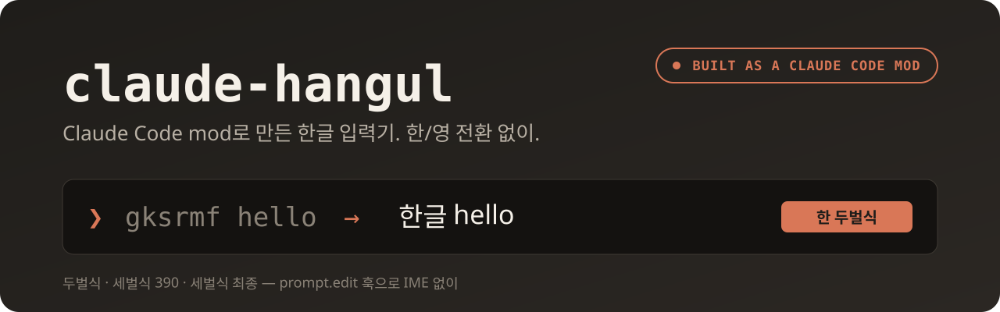

<p align="center">
  
</p>

<p align="center">
  
</p>

<p align="center">
  <a href="LICENSE"></a>
  
  <a href="https://github.com/proagent-ai/claude-hangul/releases"></a>
  
</p>

# claude-hangul

> **Claude Code mod 하나로 만든 한글 입력기.** OS IME 없이, 한/영 전환 없이.

Claude Code의 **mod**(함수 훅 플러그인) 기능으로 프롬프트 입력창에 한글 조합기를 직접 꽂았다.
두벌식, 세벌식 390, 세벌식 최종을 친다.
한/영 전환 키를 누르지 않아도 한글 단어는 한글로, 영어·숫자·기호는 친 그대로 남는다.

원격 터미널(SSH), 태블릿 외장 키보드, IME가 프롬프트까지 오지 않는 환경을 위해 만들었다.

제품 요구는 [docs/PRD.md](docs/PRD.md), 구현 근거는 [docs/SPEC.md](docs/SPEC.md).

## 설치

Claude Code 안에서:

```
/plugin marketplace add proagent-ai/claude-hangul
/plugin install hangul@proagent
```

새 버전은 `claude plugin update hangul@proagent` 후 `/reload-plugins`.
Claude Code 2.1.287 이상.

### 개발

```bash
git clone https://github.com/proagent-ai/claude-hangul.git
cd claude-hangul
git checkout develop
claude --plugin-dir .
```

작업 사본은 `--plugin-dir` 로 띄우고, 마켓플레이스 설치본과 같은 세션에 같이 올리지 않는다.

## 사용

| 명령 | 동작 |
|---|---|
| `/hangul` | 켜기 / 끄기 |
| `/hangul on` `off` | 명시적으로 켜거나 끈다 |
| `/hangul 2` `390` `final` | 레이아웃을 바꾸고 켠다 |

`/hangul` 줄의 인자는 영어 그대로다. `off` 가 한글로 바뀌지 않는다.
상태줄은 `한 두벌식`, `한 세벌식 390`, `한 세벌식 최종` 이다.

시작 레이아웃은 `HANGUL_LAYOUT=2|390|final`. 세벌식 역순 확정은 `HANGUL_SEBEOL_ORDER=strict`.

## Claude Code mod로 만들었다

OS 입력기를 건드리지 않는다. Claude Code가 키 입력을 mod에 넘겨주고, mod가 조합한 결과를 돌려준다.
훅 4개와 상태줄 하나가 전부다 ([`hooks/register.tsx`](hooks/register.tsx)).

```
 키 입력 ─▶ prompt.edit ─▶ HangulEditor ─▶ 조합된 프롬프트
                              │
 /hangul ─▶ command.run ──────┤  레이아웃 전환
 엔터    ─▶ prompt.submit ────┘  조합 중인 글자 확정
 시작    ─▶ session.start       /hangul 등록, 상태줄 `한 두벌식`
```

```ts
on('prompt.edit', async ($, e, next) => {
  const answer = editor.edit(editOf(e))
  return answer.kind === 'pass' ? next(e) : answer.box  // 조합했으면 키를 소비
})
```

- **`prompt.edit`** — 키 하나마다 들어온다. 한글이면 조합해서 돌려주고, 아니면 `next(e)` 로 넘긴다.
- **`prompt.submit`** — 보내기 직전 조합 중인 음절을 확정한다.
- **`command.run`** + **`$.command.register`** — `/hangul` 슬래시 명령.
- **`$.ui.status`** — 상태줄의 `한 세벌식 390`.

조합 코어 `core/` 는 Claude Code API를 모르는 순수 TypeScript라서 다른 곳에도 그대로 쓸 수 있다.
mod는 Claude Code early access API라 릴리스마다 바뀔 수 있다.

## 한글과 그 밖의 글자

공백이나 기호 전까지를 한 단어로 본다.

- 그 단어가 완성 음절뿐이면 한글이다. 두벌식 `gksrmf`, 세벌식 `mfskgw` 는 `한글`.
- 음절이 아닌 조각이 확정되면 그 단어는 친 키 그대로다. 세벌식 `hello` 는 `hello` 다.
- 숫자만인 단어(`390`, `123`)는 숫자다. `?` `,` `!` 처럼 표에 없는 기호는 친 문자다.
- 두벌식 숫자·기호는 친 문자 그대로다.
- 원격 접속 지연으로 키가 몇 개씩 묶여 와도 한 글자씩 친 것으로 조합한다. 줄바꿈 없이 8글자 이하면 키 묶음, 그보다 길면 붙여넣기로 보고 원문 그대로 넣는다.
- 한 음절로 끝나는 짧은 영어는 한글로 남는다. 두벌식 `to` 는 `새`.

세벌식 시프트 숫자·기호는 레이아웃 표대로 바뀐다. 390 `J K L` 은 `4 5 6`, `B` 는 `!`. 최종 `J` 는 `1`, `B` 는 `?`.
세벌식은 숫자가 시프트 자리에만 있어 치환하지 않으면 칠 방법이 없다.
기호 키는 단어의 일부라서, 그 단어가 영어로 판정되면 친 키로 돌아간다. 390 `Hello` 는 `Hello`.
치환을 끄려면 코드에서 `passthroughLiterals: true`. 명령에는 없다.

## 테스트

```bash
bun run test
claude plugin test .
claude plugin validate .claude-plugin/plugin.json
npx -p typescript@5.9.3 tsc -p .
```

`claude plugin test .` 는 141개 통과 (CLI 2.1.289).

## 구성

- `core/` — 조합 상태머신. Claude Code API에 의존하지 않는다.
- `hooks/` — `prompt.edit` 어댑터와 `/hangul` 등록.
- `tools/gen-layout.mjs` — libhangul 키보드 XML로 `core/layout-data.ts` 를 만든다.

## 기여

이슈와 PR 환영한다. 작업은 `develop` 브랜치에서 하고, PR 전에 위 [테스트](#테스트)를 돌린다.
키 배열을 고칠 때는 `core/layout-data.ts` 를 직접 고치지 말고 `tools/gen-layout.mjs` 로 다시 만든다.

## 감사

- [libhangul](https://github.com/libhangul/libhangul) — 키 배열 데이터 출처(LGPL-2.1). 키→자모 대응이라는 사실 데이터만 옮겼고 코드는 포함하지 않는다.
- GNU Emacs `hangul.el`, uim `byeoru.scm` — 키 배열 교차 검증.
- [claude-vime](https://github.com/skanehira/claude-vime) — `prompt.edit` 훅 구조를 참고했다.

## 라이선스

[MIT](LICENSE)
